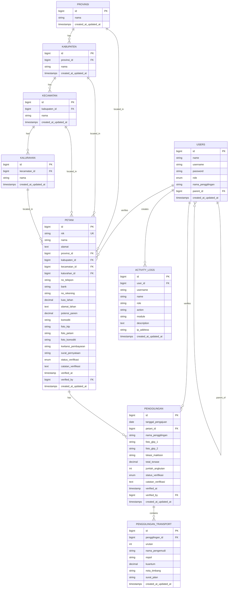
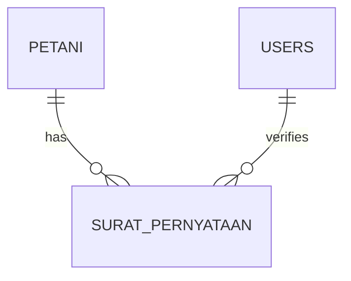
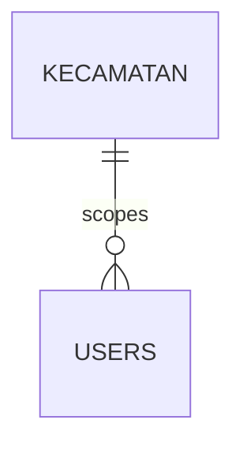

# SiJagaTani - Full Project Breakdown

## 1. Nama Project
SiJagaTani

## 2. Tujuan Project
SiJagaTani adalah aplikasi web internal untuk mengelola data petani dan data penggilingan padi, termasuk proses input, verifikasi, pencarian, ringkasan data, export laporan, serta pengelolaan wilayah dan akun berbasis role.

Fokus utamanya adalah membantu proses pendataan operasional agar lebih rapi, terpusat, dan mudah diaudit.

## 3. Bahasa Pemrograman, Framework, dan Package

### Backend
- Bahasa: PHP 8.2+
- Framework: Laravel 12
- Database: MySQL
- Package utama:
  - laravel/framework
  - laravel/sanctum
  - maatwebsite/excel
  - intervention/image
  - laravel/tinker

### Frontend
- Bahasa: JavaScript
- Framework: Vue 3
- Build tool: Vite
- Package utama:
  - vue
  - vue-router
  - pinia
  - axios
  - vite

### Dev Tooling
- concurrently
- tailwindcss
- @tailwindcss/vite / @tailwindcss/postcss
- autoprefixer
- postcss
- laravel-vite-plugin

Catatan: dari file yang ada saat ini, frontend menggunakan JavaScript biasa, bukan TypeScript.

## 4. Desain Sistem yang Digunakan

### Arsitektur Sistem
Project ini memakai desain client-server dengan pemisahan yang jelas antara frontend dan backend:

- Frontend berperan sebagai single page application dashboard.
- Backend menyediakan REST API untuk semua operasi data.
- Autentikasi memakai Laravel Sanctum.
- Otorisasi memakai role-based access control.
- Proses upload dan kompresi gambar dipisahkan ke service khusus.
- Export dan import data dipisahkan ke modul export/import.

### Pola Arsitektur
Secara struktur, project ini lebih dekat ke modular monolith dengan layered architecture, bukan clean architecture penuh.

- Controller menangani request dan response.
- Form Request menangani validasi input.
- Service menangani logika bantu seperti image processing dan activity log.
- Model menangani relasi dan akses data.
- Export/Import dipisahkan ke folder khusus.

### Desain UI / Frontend
Frontend memakai dashboard layout dengan:

- sidebar navigasi tetap
- top navbar sticky
- halaman login terpisah dari layout dashboard
- tampilan responsif desktop dan mobile
- kartu statistik dan halaman berbasis role

Styling utamanya terlihat memakai CSS kustom pada komponen Vue, dengan Tailwind tersedia sebagai toolchain pendukung.

## 5. Struktur Folder

### Level Root
```text
README.md
backend/
frontend/
```

### Backend: `backend/`
Backend menggunakan struktur Laravel standar dengan pemisahan yang cukup jelas.

```text
backend/
  app/
    Exports/
    Http/
      Controllers/
      Middleware/
      Requests/
    Imports/
    Models/
    Providers/
    Services/
  bootstrap/
  config/
  database/
    factories/
    migrations/
    seeders/
  public/
  resources/
    css/
    js/
    views/
  routes/
  storage/
  tests/
  vendor/
```

#### Penjelasan backend per folder
- `app/Http/Controllers/Api`: endpoint API untuk auth, petani, penggilingan, user, sub-admin, wilayah, dan activity log.
- `app/Http/Requests`: validasi form input sebelum masuk ke controller.
- `app/Services`: logika bantu seperti upload/compress image dan activity logging.
- `app/Exports`: kelas export Excel.
- `app/Imports`: kelas import data wilayah.
- `app/Models`: model inti sistem dan relasi database.
- `database/migrations`: riwayat perubahan skema database.
- `database/seeders`: data awal untuk user dan data domain.
- `routes/api.php`: seluruh endpoint API utama.
- `routes/web.php`: route web dasar Laravel.

### Frontend: `frontend/`
Frontend lebih terasa sebagai struktur by feature karena halaman dan komponen dipisahkan berdasarkan fungsi.

```text
frontend/
  src/
    App.vue
    main.js
    assets/
    components/
    data/
    router/
    services/
    stores/
    views/
```

#### Penjelasan frontend per folder
- `src/views`: halaman utama per fitur dan per page.
- `src/components`: komponen UI yang dipakai ulang, seperti sidebar dan filter.
- `src/router`: konfigurasi navigasi dan guard role.
- `src/stores`: state management, terutama autentikasi.
- `src/services`: helper untuk komunikasi API.
- `src/assets`: logo dan aset visual.

## 6. Pembagian Arsitektur: Clean Architecture atau By Feature

### Backend
Backend belum clean architecture penuh. Struktur yang dipakai lebih cocok disebut layered modular monolith.

Alasannya:
- controller masih menjadi titik masuk utama API
- business support logic ada di service class
- validasi dipisahkan ke request class
- fitur domain dipisahkan lewat folder export/import/model/controller

### Frontend
Frontend lebih dekat ke by feature.

Alasannya:
- halaman dipisahkan per domain di `views`
- navigasi dibatasi berdasarkan role
- store dan service mendukung fitur spesifik aplikasi
- layout dashboard dipakai lintas halaman

## 7. Core Pages

Halaman inti yang sudah terlihat di frontend:

- Login
- Home / Dashboard
- Data Petani
- Surat Pernyataan
- Data Penggilingan / Data Makloon
- Kelola Sub-Admin
- Kelola Akun
- Data Wilayah
- Log Aktivitas
- About

## 8. Feature yang Sudah Jalan

### Autentikasi dan Akses
- Login dan logout
- Penyimpanan token autentikasi
- Guard route di frontend
- Role-based access control
- Role yang terlihat di sistem: superadmin, admin, lapangan, penggilingan

### Dashboard
- Ringkasan data berbasis role
- Statistik petani, penggilingan, sub-admin, luas lahan, potensi panen, tonase, dan angkutan
- Komponen kartu statistik dan visual ringkasan

### Data Petani
- CRUD data petani
- Pencarian dan filter
- Upload foto petani
- Kompresi gambar otomatis
- Export ke Excel
- Verifikasi data
- Cek NIK

### Data Penggilingan
- CRUD data penggilingan
- Ringkasan data penggilingan
- Upload gambar pendukung
- Kompresi gambar otomatis
- Export ke Excel
- Export Makloon GKP
- Verifikasi data

### Surat Pernyataan
- Halaman surat pernyataan sudah tersedia di frontend
- Terkait dengan modul petani dan alur operasional lapangan

### Wilayah
- Data provinsi, kabupaten, kecamatan, dan kalurahan
- Endpoint read-only untuk semua user login
- CRUD wilayah untuk superadmin
- Export, import, dan template wilayah

### User dan Sub-Admin
- Manajemen akun user untuk superadmin
- Manajemen sub-admin untuk parent penggilingan
- Relasi parent-child user sudah disiapkan

### Audit dan Logging
- Activity log tersedia
- Endpoint dan halaman log aktivitas sudah ada

### File dan Media
- Upload file/gambar
- Kompresi gambar otomatis
- Storage public via symbolic link

## 9. Feature yang Belum Terlihat atau Belum Selesai di Repo Saat Ini

Bagian ini ditulis berdasarkan file yang tersedia di repository sekarang, jadi statusnya adalah "belum terlihat" atau "belum ada indikasi implementasi penuh".

- Public landing page informasi perusahaan atau profil produk
- Fitur reset password / forgot password
- Email verification flow
- Profile settings page untuk user biasa
- Notification system
- Advanced reporting selain export Excel dan summary dasar
- API documentation formal seperti Swagger / OpenAPI
- Test coverage yang sudah lengkap untuk alur bisnis utama
- TypeScript frontend
- Progressive web app / mobile app companion

## 10. Ringkasan Singkat

SiJagaTani adalah aplikasi dashboard operasional untuk pendataan petani dan penggilingan dengan backend Laravel dan frontend Vue 3. Struktur project saat ini paling pas dibaca sebagai backend layered modular monolith dan frontend by feature, dengan akses berbasis role dan modul domain yang sudah cukup matang untuk data petani, penggilingan, wilayah, user, sub-admin, export, import, dan audit log.

## 11. Rancangan ERD

Berikut rancangan ERD yang menggambarkan rangkaian data utama project ini.



### Penjelasan Relasi Utama

- `users.parent_id` membentuk relasi self-reference untuk parent penggilingan dan sub-admin.
- `petani` menyimpan lokasi administratif melalui `provinsi_id`, `kabupaten_id`, `kecamatan_id`, dan `kalurahan_id`.
- `petani.verified_by` dan `penggilingan.verified_by` mengarah ke `users.id` untuk audit verifikasi.
- `penggilingan.petani_id` menghubungkan data penggilingan ke petani pemilik data dasar.
- `penggilingan_transport.penggilingan_id` menyimpan detail armada/angkutan per transaksi penggilingan.
- `activity_logs.user_id` merekam siapa yang melakukan aksi di sistem.

### Tabel Sistem Pendukung

Di luar domain utama di atas, Laravel juga menyiapkan tabel pendukung berikut:

- `password_reset_tokens` untuk alur reset password
- `sessions` untuk penyimpanan session user

Tabel pendukung ini tidak dimasukkan ke diagram inti karena fungsinya lebih ke infrastruktur autentikasi framework.

## 12. Catatan Desain Lanjutan

Ada dua detail yang layak dipertimbangkan jika scope sistem berkembang.

### Surat Pernyataan: Kolom vs Tabel Terpisah

Saat ini `petani.surat_pernyataan` disimpan sebagai path string. Desain ini sudah tepat jika kebutuhan sistem hanya menyimpan 1 dokumen terbaru per petani.

Jika suatu saat petani perlu punya riwayat surat pernyataan per musim panen atau per tahun, maka lebih aman dipecah menjadi tabel tersendiri, misalnya:

```text
SURAT_PERNYATAAN
- id
- petani_id FK
- nomor_surat
- periode
- file_path
- status_verifikasi
- catatan_verifikasi
- verified_at
- verified_by
- created_at
- updated_at
```

Relasi yang disarankan:



Dengan model ini, histori dokumen tetap aman tersimpan dan tidak menimpa file lama.

### Pembatasan Wilayah User: Data Isolation

Saat ini tabel `users` belum punya field wilayah. Kalau nanti admin lapangan hanya boleh mengelola data di kecamatan tertentu, ada dua pendekatan yang bisa dipakai:

1. Pendekatan sederhana: tambahkan `kecamatan_id` nullable ke tabel `users`.
2. Pendekatan fleksibel: buat tabel relasi seperti `user_wilayah_access` bila satu user bisa memegang lebih dari satu wilayah.

Rekomendasi paling praktis untuk saat ini adalah menambah `kecamatan_id` pada `users` jika scope user hanya satu wilayah utama.

Contoh relasi ERD untuk pendekatan sederhana:



Jika kebutuhan akses menjadi banyak wilayah, lebih baik gunakan tabel pivot supaya filter data tetap rapi dan tidak membatasi user ke satu kecamatan saja.
